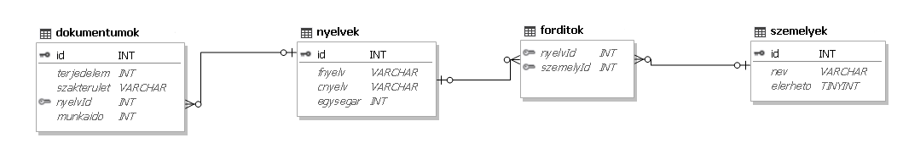

# Adatbazis_2024_Csapat4

# Fordítóiroda

### Egy idegennyelvi fordítóiroda minden beérkezett megrendelésre árajánlatot készít. A megrendelt dokumentumok és a fordítók adatai állnak rendelkezésre az adatbázisban. A feladatok megoldása előtt nézze meg a táblák mezőit, kapcsolatait! A következő feladatok megoldásánál a lekérdezéseket a zárójelben olvasható néven mentse! Ügyeljen arra, hogy a lekérdezésekben pontosan a kívánt mezők szerepeljenek, felesleges mezőt ne jelenítsen meg! 

## `1.Feladat`:

### Futtassa le az `iroda.sql` állományt az alábbi táblák(`dokumentumok`, `nyelvek`, `forditok`, `személyek`) létrehozásához!

### Készítsen új adatbázist iroda néven! Hozza létre a megadott táblákat és azoknak mezőit, majd töltse fel a megadott adatokkal! A feladatok elkészítésére szolgáló feladatok megoldását mentse a `megoldas.sql` fájlba!

## Táblák:

|**dokumentumok**| (id, terjedelem, szakterulet, nyelvid, munkaido)                               |
|:--------------:|:--------:                                                                      |
|`id `           | A fordítandó dokumentum azonosítója (szám), ez az elsődleges kulcs (PK)        |
|`terjedelem`    | A dokumentum karaktereinek száma (szám)                                        |
|`szakterulet`   |  A dokumentum szakterülete (szöveg)                                            |
|`nyelvId`       | A forrás- és a célnyelv párok azonosítója (szám) az összetett kulcs része (FK) |
|`munkaido`      |  A fordítás elvégzésére becsült idő órában (szám)                              |
 
 

|**nyelvek**| (id, fnyelv, cnyelv, egysegar)                                      |
|:---------:|:--------:                                                           |
|`id`       | A fordítási nyelvpár azonosítója (szám), ez az elsődleges kulcs(PK) |
|`fnyelv`   | A forrás dokumentum nyelve (szöveg)                                 |
|`cnyelv`   | A cél dokumentum nyelve (szöveg)                                    |
|`egysegar` |5000 karakternél nem hosszabb fordítás ára adott nyelvpár esetén     |
 
 

|**forditok**|(nyelvid, szemelyid)                                                                             |  
|:---------: |:--------:                                                                                       |                                
|`nyelvId`   | Annak a nyelvpárnak az azonosítója, amit a fordító vállal (szám), az összetett kulcs része (FK) |
|`szemelyId` |          A fordító azonosítója (szám), az összetett kulcs része (FK)                            |
 
 

|**szemelyek**|(id, nev, elerheto)                                       |
|:------:     |:--------:                                                |
|`id`         | A fordító azonosítója (szám), ez az elsődleges kulcs (PK)|
|`nev`        | A fordító neve (szöveg) – azonos nevűek nincsenek        |
|`elerheto`   |  A fordító aktuális munkaképessége (logikai)             |
 
 

 
 

## `2.Feladat`:

### A fordítóiroda utólag vállalt egy új nyelvről való fordítást. Adja hozzá a nyelvek adattáblához a következőket. Az id legyen 145, forrás nyelve török, a cél dokumentum nyelve román, illetve az egységár pedig legyen 3000Ft. (**2.feladat**)
.PNG>)
 
 

## `3.Feladat`:

### A személyek adattáblában elírtak egy nevet. Módosítsa a 75-ös azonosítójú Nagy Tímea nevét Kiss Tímeára. (**3.feladat**)
### Minta ide nem kell!!!
.PNG>)
 
 

## `4.Feladat`:

### A dokumentumok táblában történt egy tévedés, és a rendszerbe valamilyen módon bekerült a 25-ös id-val rendelkező sport szakterületű dokumentum. Keresse meg és törölje ki az adattáblából. (**4.feladat**)
### Minta ide nem kell!!!
### Teljesen más van a megodásoknál !!!
.PNG>)
 
 

## `5.Feladat`:

### Készítsen lekérdezést, amely ábécérendben megjeleníti azoknak a fordítóknak a nevét, akik új munkát tudnak vállalni! (**5.feladat**)
.PNG>)
 
 

## `6.Feladat`:

### Készítsen lekérdezést, amely meghatározza az 5000 és az annál kisebb karakterszámú dokumentumok számát és az ezek fordításáért járó összbevételt! (**6.feladat**)
.PNG>)
 
 

## `7.Feladat`:

### Készítsen lekérdezést, amely megadja az angolról magyarra fordítandó(50-es nyelvId-val rendelkező) dokumentumok terjedelmét és szakterületét! A lista terjedelem szerint csökkenően jelenjen meg! (**7.feladat**)

### Itt az 50-es id-t nem szabadott volna megadni, le kellett volna kérdezni!!!!

.PNG>)
 
 

## `8.Feladat`:

### Melyik szakterülethez tartoznak és melyik nyelvről melyikre kell azokat a dokumentumot fordítani, amelyekre majdnem pontosan egy munkanapnyi (7-9 óra) fordítási időt becsültek? Adja meg lekérdezés segítségével a szakterületeket, a forrás- és a célnyelvek nevét a forrásnyelv szerint ábécé sorrendben! (**8.feladat**)
.PNG>)
 
 

## `9.Feladat`:

### Lekérdezés segítségével adja meg azoknak a fordítóknak a nevét, akik magyarról a legtöbb célnyelvre vállalnak fordítást! Több ilyen fordító esetén elegendő egyet megjeleníteni. (**9.feladat**)
.PNG>)
 
 

## `10.Feladat`:

### Ez egy jelentéses feladat volt, amit nem sikerült lekérdezéses feladatra alakítani!!!!

### Készítsen lekérdezést, amely kilistázza szakterületenként, hogy melyik nyelvről melyikre kell fordítani a megrendelt dokumentumokat. A listát szakterületenként csoportosítsa és azon belül minden nyelvpár egyszer jelenjen meg a forrásnyelv szerint ábécé-rendben! A lekérdezés elkészítésekor a mintából a mezők sorrendjét, a címet és a mezőnevek megjelenítését vegye figyelembe! A lekérdezés formázásában a mintától eltérhet. (**10.feladat**)
.PNG>)
 
 
