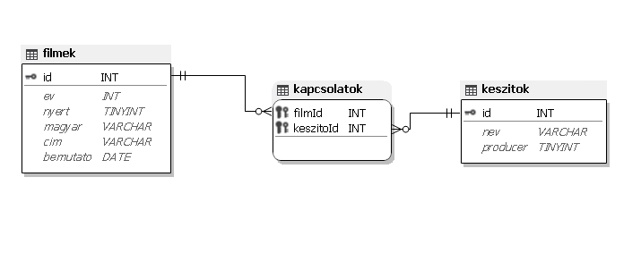
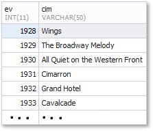
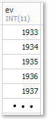
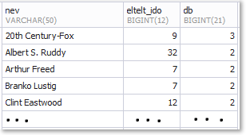

# 3. Oscar-díjas filmek 

Az Oscar-díj az egyik legnagyobb elismerés, amely a filmművészetben létezik. Számtalan
kategóriában ítéli oda az amerikai Filmművészeti és Filmtudományi Akadémia, így például a
legjobb rendező, színész, színésznő. A díjat az előző évben készült filmek egyike nyerheti el.
A hosszas kiválasztási folyamat végén néhány filmet „nominálnak” (jelölnek) a díjra és a zsűri
ezek közül választja ki a legjobbat. Ez az adatbázis a jelölt filmeket tartalmazza. 

---
### Feladatok:
- [3. Oscar-díjas filmek](#3-oscar-díjas-filmek)
    - [Feladatok:](#feladatok)
  - [1. Készítsen új adatbázist oscar néven!](#1-készítsen-új-adatbázist-oscar-néven)
    - [Táblák:](#táblák)
      - [1. `filmek`](#1-filmek)
      - [2. `kapcsolatok`](#2-kapcsolatok)
      - [3. `keszitok`](#3-keszitok)
  - [2. feladat](#2-feladat)
  - [3. feladat](#3-feladat)
  - [4. feladat](#4-feladat)
  - [5. feladat](#5-feladat)
  - [6. feladat](#6-feladat)
  - [7. feladat](#7-feladat)
    - [Nem jó a feladat megoldása, a bemutató idejét is ellenőrizni kell, hogy a megadott időszakban volt-e!!!!](#nem-jó-a-feladat-megoldása-a-bemutató-idejét-is-ellenőrizni-kell-hogy-a-megadott-időszakban-volt-e)
  - [8. feladat](#8-feladat)
  - [9. feladat](#9-feladat)
    - [Csak jelölést ír a feladat, nem kell a nyert=True vizsgálat a megoldásba](#csak-jelölést-ír-a-feladat-nem-kell-a-nyerttrue-vizsgálat-a-megoldásba)
  - [10. feladat](#10-feladat)
  - [11. feladat](#11-feladat)

---
## 1. Készítsen új adatbázist oscar néven!

Futtassa le a **oscardijasfilmek.sql** állományt az alábbi táblák(`filmek`, `kapcsolatok`, `keszitok`) létrehozásához és feltöltéséhez

### Táblák:
#### 1. `filmek`

| Azonosító | Típus   | Leírás                                    |
| :-------: | :-----: | :----:                                    |
| id        | int     | A film azonosítója, ez az elsődleges kulcs|
| ev        | int     | A film Oscar-díjra jelölésének éve        |
| nyert     | bool    | A film elnyerte-e a díjat                 |
| magyar    | varchar | A film magyar nyelvű címe, ha ismert      |
| cim       | varchar | A film eredeti címe. A címek egyediek     |
| bemutato  | date    | A film magyarországi bemutatójának dátuma |

#### 2. `kapcsolatok`

| Azonosító | Típus | Leírás                                    |
| :-------: | :---: | :----:                                    |
| filmId    | int   | A film azonosítója, ez az idegen kulcs    |
| keszitoId | int   | A készítő azonosítója, ez az idegen kulcs |

#### 3. `keszitok`

| Azonosító | Típus   | Leírás                                        |
| :-------: | :-----: | :----:                                        |
| id        | int     | A készítő azonosítója, ez az elsődleges kulcs |
| nev       | varchar | A készítő neve                                |
| producer  | bool    | A név producerhez tartozik-e                  |

A következő feladatokat megoldó SQL parancsokat rögzítse a **megoldások.sql** állományban a feladatok végén zárójelben jelölt sor alá! A javítás során csak ennek az állománynak a tartalmát értékelik.

Ügyeljen arra, hogy a lekérdezésekben pontosan a kívánt mezők szerepeljenek, felesleges mezőt ne jelenítsen meg!

## 2. feladat
A táblázat egy meghibásodás következtében, csak a 2019-ig megtartott Orscar-díjátadók adatait tartalmazza. Javítsd ki e problémát a 2020-as eredmények beillesztésével! (Elég egy konkrét példát beilleszteni => id(900, ev(2020), nyert(1), magyar("Még egy kört mindenkinek"), cim("Druk"), bemutato(null)).)

## 3. feladat
Frissítsd a legutóbb hozzáadott adat ID-ját egy tetszőleges négyjegyű számra, melynek számjegyei különböző értékeket képviselnek!

## 4. feladat
Chuck Norris nyakonrúgta a "Még egy kört mindenkinek" című film rendezőjét. A film így végül nem került megrendezésre. Amennyiben megtalálható az adatbázisban, kerüljön törlésre.

## 5. feladat
Készítsen lekérdezést, amely az elismerés évének sorrendjében jeleníti meg az Oscar-díjas
filmeket! Az elnyerés éve és a film eredeti címe jelenjen meg!

## 6. feladat
Készítsen lekérdezést, amely megadja, hogy mely években jelöltek legalább 10 filmet a díjra! Csak a jelölés évét jelenítse meg!

## 7. feladat
Készítsen lekérdezést, amely megadja azon filmek eredeti címét, amelyeket a második világháború éveiben (1939 és 1945 között, a határokat is beleértve) jelöltek és ebben az időszakban be is mutattak hazánkban!
### Nem jó a feladat megoldása, a bemutató idejét is ellenőrizni kell, hogy a megadott időszakban volt-e!!!!

## 8. feladat
Készítsen lekérdezést, amely megadja, hogy mely nyertes filmek esetén volt a magyarországi bemutató legalább 10 évvel később, mint a díjazás! Csak a film eredeti címét jelenítse meg!

## 9. feladat
Vannak olyan producerek, akiknek több filmjét is jelölték díjra, e feladatban őket keressük. Készítsen lekérdezést, amely megadja, hogy hány év telt el a legelső és a legutolsó jelölés között! Jelenítse meg a producer nevét, a jelölések számát és az első és utolsó jelölés között eltelt időt!
### Csak jelölést ír a feladat, nem kell a nyert=True vizsgálat a megoldásba

## 10. feladat
Nem ritka, hogy egy-egy filmnek több, akár három-négy producere is van. Készítsen lekérdezést, amely megadja, hogy a jelölést kapott, azaz az adatbázisban tárolt filmekben kik voltak „Clint Eastwood” producertársai! Az érintett személyek nevét jelenítse meg, és biztosítsa, hogy mindenki csak egyszer szerepeljen!

## 11. feladat
Készítsen lekérdezést, amely megadja, hogy kik azok a producerek, akiknek egyetlen Oscar-díjra jelölt filmje esetén sem ismert a magyarországi bemutató dátuma!

