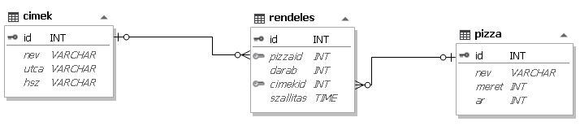

# **3. Pizzafutár**

   Egy kisvárosi pizzafutár-vállalkozásnál a telefonos rendelések alapján adatbázist hoznak 
létre. A választható pizzák és egy adott nap megrendeléseinek néhány adata áll rendelkezésre.

## **1.feladat**
Futtassa le a Pizzafutár.sql állományt az alábbi táblák(pizzak, rendelesek, cimek) létrehozásához és feltöltéséhez.

## **Táblák:**
#### 1. `pizzak` (id, nev, meret, ar) 

|Id|Típus|Leírás|Kulcs|
|---|---|---|---|
| id | int | A pizza azonosítója | PK |
| nev | string | A pizza neve ||
| meret | int | A pizza mérete centiméterben ||
| ar | int | A pizza ára forintban ||

#### 2. `rendelesek` (id, pizzaid, darab, cimid, szallitas)

|Id|Típus|Leírás|Kulcs|
|---|---|---|---|
| id | int | A rendelés azonosítója | PK |
| pizza_Id | int | A pizza azonosítója | FK |
| darab | int | Adott pizzából rendelt mennyiség ||
| cim_Id | int | A rendelő személy azonosítója | FK |
| szallitas | date | A rendelés teljesítésére kért időpont ||

#### 3. `cimek` (id, nev, utca, hsz) 

|Id|Típus|Leírás|Kulcs|
|---|---|---|---|
| id | int | A rendelő személy azonosítója | PK |
| nev | string | A személy neve ||
| utca | string | A rendelési cím utcája ||
| hsz | string | A rendelési cím házszáma ||

A következő feladatokat megoldó SQL parancsokat rögzítse a megoldások.sql állományban a feladatok végén zárójelben jelölt sor alá! A javítás során csak ennek az állománynak a tartalmát értékelik.

Ügyeljen arra, hogy a lekérdezésekben pontosan a kívánt mezők szerepeljenek, felesleges mezőt ne jelenítsen meg!

## **2.feladat**
  Illessze be az 5 sajtos, csak 22es méretben kapható, 1200 Ft árú új pizzát a `*pizzak*` táblába!

## **3.feladat**
  Állítsa be, hogy az összes olyan pizza a `*pizzak*` táblából amelynek a nevében szerepel az "5" ára 500 Ft-al nőjön!

## **4.feladat**
  Törölje ki az 5000 Ft-nál drágább pizzákat a `*pizzak*` táblából!

## **5.feladat**
  Állítsa be, hogy a `*pizzak*` tábla ar mezője tizedesjegyek nélkül, „==Ft==” mértékegységgel jelenjen 
meg! 

## **6.feladat**
  Készítsen lekérdezést, amely megadja az 1500 Ft-nál olcsóbb pizzák nevét, méretét és árát! 
A lista méret szerint csökkenően, és azon belül név szerint ábécésorrendben jelenjen meg! 
**(3olcso)** 

## **7.feladat**
  Milyen nevű és milyen méretű pizzából kellett a legtöbbet sütni az összes megrendelés 
alapján?  Adja  meg  lekérdezés  segítségével  a  pizza  nevét,  méretét  és  a  darabszámát! 
**(4nepszeru)**

## **8.feladat** 
 Sorolja fel lekérdezés segítségével, hogy a pizzák neve és mérete szerint 18 és 19 óra közötti 
szállításra (az időhatárokat is beleértve) hány darab pizzára vettek fel rendelést! **(5esti)**

## **9.feladat** 
 Készítsen lekérdezést úgy, hogy azoknak a pizzáknak a nevét adja meg, 
amelyekből  mindhárom  méretben  volt  rendelés!  A  kiegészített  lekérdezést  mentse! 
**(6jolfogy)**

A fenti lekérdezés szövege a források között a `*6alap.sql*` fájlban megtalálható.

## **10.feladat**
  Ha egy időpontban háromnál több darab pizzát szállít egy címre a futár, akkor a cég egy 
ajándék üdítőitallal lepi meg a rendelőt. Lekérdezés segítségével sorolja fel a szállítási idő, 
név, utca és házszám adatokat, ahova a futárnak üdítőitalt is vinnie kell! **(7reklam)**

## **11.feladat**
 Készítsen  lekérdezést  amely  megadja,  hogy  a  rendelési  címeken  mennyit  kell  fizetni 
a kiszállítás  időpontjában!  Vegye  figyelembe,  hogy  ha  egy  adott  szállítási  időpontban 
a rendelő személye azonos, akkor az összeget egyszerre fizetik ki! A lekérdezés formázásában a mintától 
eltérhet. **(8osszeg)**

---

Az eredeti feladat: [Pizzafutár.pdf](http://informatika.fazekas.hu/wp-content/uploads/2015/10/e_adatb_2018_id.pdf)
 