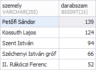
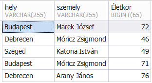
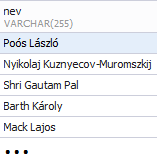
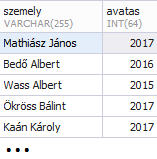
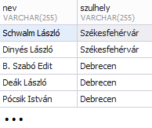
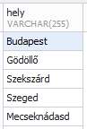
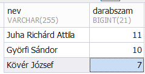

# 3. Mellszobrok

Hazánkban sok ezer műalkotás található a köztereken és közösségi terekben. Ezen alkotások
szubjektív bemutatására vállalkozott egy független és önkéntes munkára épülő webes közösség.
Gyűjtésükből a mellszobrok és alkotóik néhány adatával foglalkozik a feladat.

---

> [!CAUTION]
> A következő feladatok megoldásánál a lekérdezéseket a ***Vezetéknév-Keresztnév-Osztály_mellszobrok.sql*** néven mentse!  
> Ügyeljen arra, hogy a lekérdezésben pontosan a kívánt mezők szerepeljenek, felesleges mezőt ne jelenítsen meg!  
> Feltételezheti, hogy a megadott nevek egyértelműen azonosítják a rekordokat!  
> Feltételezheti, hogy a megoldások során nem alakul ki holtverseny!

### Táblák:
#### 1. `szobrok` (id, szemely, hely, avatas, rogzites)
|Név|Típus|Leírás|Kulcs|
|---|---|---|---|
| id | int | A szobor azonosítója | ✔ |
| szemely | varchar | Az ábrázolt személy neve ||
| hely | varchar | A szobor felállítási helye ||
| avatas | int | A szobor avatásának éve ||
| rogzites | date | Az adatbázisba rögzítés dátuma ||

#### 2. `kapcsolatok` (szoborId, alkotoId)
|Név|Típus|Leírás|Kulcs|
|---|---|---|---|
| szoborId | int | A szobor azonosítója | ✔ |
| alkotoId | int | Az alkotó azonosítója | ✔ |

#### 3. `alkotok` (id, nev, nem, szulev, szulhely)

|Név|Típus|Leírás|Kulcs|
|---|---|---|---|
| id | int |  Az alkotó azonosítója | ✔ |
| nev | varchar | Az alkotó neve  ||
| nem | char | Az alkotó neme ||
| szulev | int | Az alkotó születési éve ||
| szulhely | varchar | Az alkotó születési helye ||

# Feladatok:
---
## 1. feladat
Feladatok megoldása előtt futtassa a `mellszobrok.sql` fájlt!

## 2. feladat
Jegyezze be az alkotók táblába az `9999`.-ik helyre `Molnár Ferenc`-et, aki `1945`-ben `Tatabányán` született férfi alkotó volt.

## 3. feladat
A 9999. azonosítójú alkotó neve az előző feladatban rosszul lett megadva. Javítsa ki `Nagy Ferenc`-re a nevét.

## 4. feladat
A 9999. azonosítójú alkotó egy szélhámos volt. Törölje ki az alkotók táblából!

## 5. feladat 
Kisfaludi Strobl Zsigmond alkotta a Budapesten, 1963-ban avatott egyetlen Csajkovszkijt
ábrázoló mellszobrot. Jegyezze be ezt a tényt a kapcsolat táblába! A feladat megoldásához
nem szükséges lekérdezést készítenie.

## 6. feladat 
Készítsen lekérdezést, amely megadja azt az 5 személyt, akiket a legtöbb szobor ábrázol!
Jelenítse meg a megformált személy nevét és a darabszámot, a darabszám szerint csökkenő
sorrendben!

## 7. feladat 
Medgyessy Ferenc kétszeres Kossuth-díjas szobrász. Készítsen lekérdezést, amely
megadja, hogy mellszobrai hol állnak, kit ábrázolnak és az alkotó hány éves korában avatták
fel azokat!

## 8. feladat 
Készítsen lekérdezést, amely megadja azon adatbázisban szereplő alkotók nevét, akiknek
a születési évük és születési helyük közül csak az egyik ismert!

## 9. feladat 
Készítsen lekérdezést, amely megadja, hogy mely budapesti szobrok adatai kerültek
az adatbázisba az avatás évében! Az ábrázolt személy nevét és az avatás évét adja meg!

## 10. feladat 
Készítsen lekérdezést, amely megadja, hogy kik azok a múlt század első felében (1901 és
1950 között, a határokat is beleértve) született alkotók, akiknek születési helyén van általuk
készített szobor! Az alkotó neve és születési helye jelenjen meg, de mindenki csak egyszer!
A budapesti alkotásokat ne vegye figyelembe!

## 11. feladat 
Mely településeken kapott mellszobrot „Erkel Ferenc” és „Liszt Ferenc” is?

## 12. feladat 
Készítsen lekérdezést a debreceni mellszobor alkotókról, melyben megszámolja, hogy egyes alkótók mennyi szobrot csináltak és ez alapján csökkenő sorrendbe rendezi őket.
3-nél több eredmény ne jelenjen meg.

---

Az eredeti feladat: [Mellszobrok.pdf](http://informatika.fazekas.hu/wp-content/uploads/2023/02/Mellszobrok.pdf)
 
Csapattagok:
- [Gehér Marcell](https://github.com/Geher-Marcell)
- [Gerencsér Olivér](https://github.com/GerencserOliver)
	
